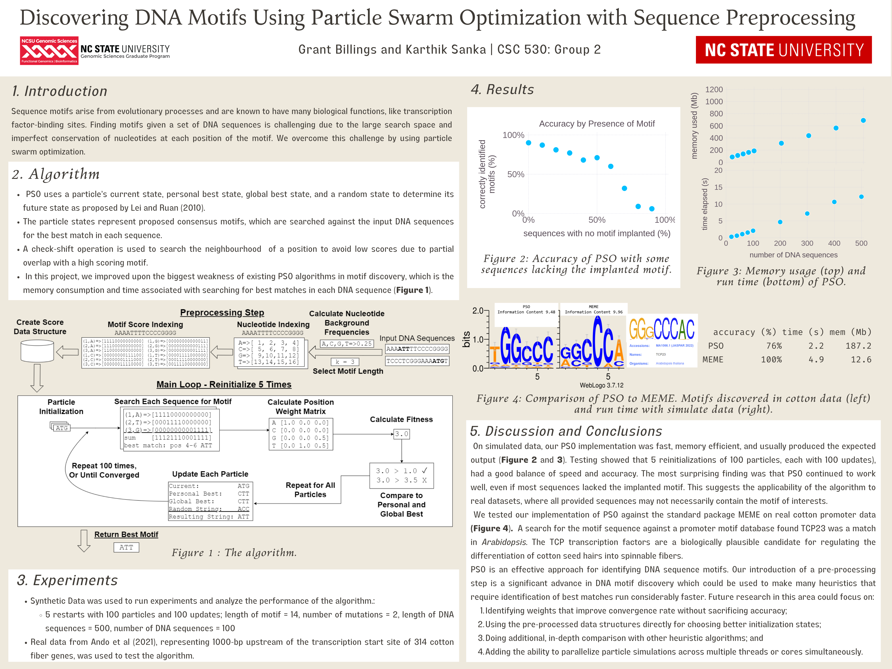

# CSC 530 Group Project - Nature Inspired Motif Detection
(c) 2022 Grant Billings and Karthik Sanka  
* Motif Finding Problem :
  * The process of discovering patterns in a collection of sequences, such as DNA sequences.
  * Given : DNA sequences, no prior knowledge about where a motif could be in each sequence.
  * Output : Motifs with different number of mutations allowed.
* Motif finding problem is an NP-complete problem. Due to the size and the number of DNA sequences in practice, it is often intractable to use conventional brute force search methods to solve this problem.
* This work adopts Particle Swarm Optimization, a nature inspired metaheuristic optimization to solve Motif Finding problem.

* Please run All Output > Clear and Execution Timing > Clear (All) before pushing to the repo, or the diffs are very ugly! And merging our independent work will be very challenging.  
* The following is the poster describing our project:
  

### References 
Lei, C., Ruan, J. A particle swarm optimization-based algorithm for finding gapped motifs. BioData Mining 3, 9 (2010). https://doi.org/10.1186/1756-0381-3-9

